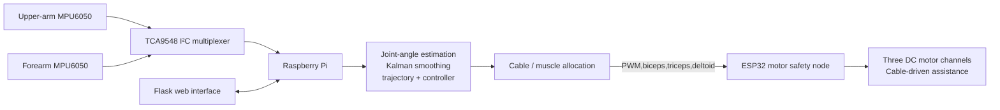
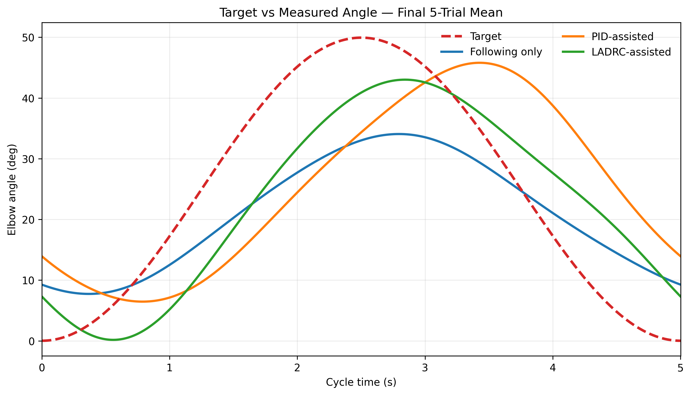
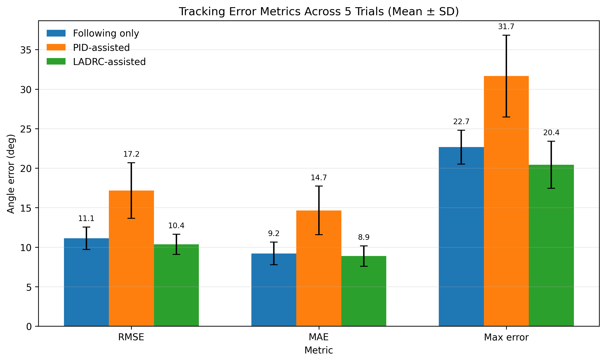
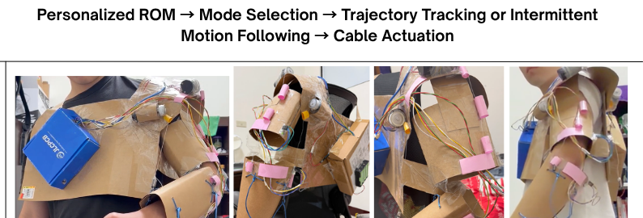

# Dual-IMU-Based Upper-Limb Rehabilitation Assistance System

An embedded rehabilitation platform that combines dual-IMU motion sensing, real-time control, cable-driven assistance, and a browser-based operator interface.

> **Research prototype — not a clinical device.** This repository documents an engineering project for upper-limb motion measurement and assistive-control experiments. Hardware-specific limits, wiring, and safety validation are required before any physical use.

## Overview

The system measures upper-arm and forearm motion with two MPU6050 IMUs. A Raspberry Pi estimates joint motion, generates a rehabilitation target trajectory, and calculates an assistive motor command. The command is allocated to cable-driven biceps, triceps, and deltoid channels, then sent to an ESP32 motor-safety node over USB serial.

The project focuses on trajectory-guided elbow and shoulder rehabilitation experiments. The web interface provides live status, trajectory and controller settings, motor control, emergency-stop actions, and CSV recording for later analysis.

## System architecture



## Key capabilities

- Dual-MPU6050 upper-arm and forearm sensing through an I²C multiplexer.
- Joint-angle estimation with complementary filtering and one-dimensional Kalman smoothing.
- Configurable sine and step rehabilitation trajectories for elbow or shoulder tasks.
- P, PI, PID, and assist-as-needed controller modes implemented in the Raspberry Pi control module.
- Cable allocation for biceps, triceps, and deltoid channels, including antagonist release and optional encoder-limit checks.
- Flask-based browser interface for initialization, live monitoring, parameter changes, recording, motor commands, and emergency stop.
- USB serial protocol between Raspberry Pi and ESP32 at 115200 baud.
- ESP32-side safety state machine: explicit arming, strict PWM validation, a 300 ms command timeout, a latched emergency stop, and a 10 ms output ramp.

## Representative results

The repository includes selected final-report figures and presentation material. These figures are retained as project evidence; their numerical interpretation should be read together with the final experimental report.

| Trajectory tracking | Error metrics |
| --- | --- |
|  |  |



## Repository guide

| Path | Purpose |
| --- | --- |
| `imu_control.py` | Dual-IMU acquisition, calibration, angle estimation, trajectory generation, and controller output. |
| `muscle_allocator.py` | Maps a joint-level command to biceps, triceps, and deltoid PWM channels. |
| `esp32_motor_bridge.py` | Raspberry Pi USB-serial bridge and motor feedback parser. |
| `web_GUI_control.py` | Flask server and embedded browser UI for operation and CSV recording. |
| `manual_motor_control.py` | Separate, time-bounded manual motor test console / GUI. |
| `esp32/esp32.ino` | ESP32 three-channel motor safety firmware. |
| `ESP32_Motor_Safety_Node/` | Firmware copy and Chinese upload / test notes. |
| `畢業專題簡報/` | Final experimental report, selected figures, and presentation material. |

## Control and safety design

The control module accepts a selected joint, trajectory, controller mode, deadband, assistance delay, output limit, and P/PI/PID gains. Its output is not applied directly to a motor: `MuscleAllocator` maps it to the antagonistic cable channels and can block movement that exceeds available encoder limits.

The ESP32 does not accept PWM commands until it receives `ARM`. A valid command must follow `PWM,p1,p2,p3` with each signed value in the range -255 to 255. The node ramps applied PWM every 10 ms, stops on a 300 ms command timeout, and latches `ESTOP` until `CLEAR` followed by `ARM`.

## Getting started

This repository is intended to be run on the project Raspberry Pi with the connected hardware.

1. Install Python 3 and the packages used by the code: `Flask`, `pyserial`, and an SMBus implementation (for example, `python3-smbus` on Raspberry Pi OS).
2. Connect the MPU6050 sensors through the configured I²C multiplexer and upload `esp32/esp32.ino` to the ESP32.
3. Review the hardware-specific values before operation, especially the ESP32 serial port, motor signs, encoder limits, PID gains, output limit, and cable routing.
4. Start the operator interface with:

   ```bash
   python3 web_GUI_control.py
   ```

5. Open the address reported by Flask, initialize and calibrate the IMUs, then configure a trajectory before enabling motor output.

`web_GUI_control.py` defaults to `/dev/ttyUSB0` and leaves automatic ESP32 connection disabled. This is intentional: the communication and mechanical setup must be reviewed on the target hardware first.

## Engineering contribution

This project integrates the Raspberry Pi control software, ESP32 firmware, dual-IMU sensing, serial communication, web operator interface, motor-control safety handling, cable-driven command allocation, and experimental test workflow into one rehabilitation-assistance prototype.

## Related material

- [`Final_Experimental_Results_Report.docx`](畢業專題簡報/Final_Experimental_Results_Report.docx)
- [`Cross-Correlation_Delay_Analysis_Supplementary_20260918.pptx`](畢業專題簡報/Cross-Correlation_Delay_Analysis_Supplementary_20260918.pptx)

The repository intentionally excludes local backups, draft documents, temporary build output, and prior test exports. Those files are preserved locally but are not part of this public-facing source release.
